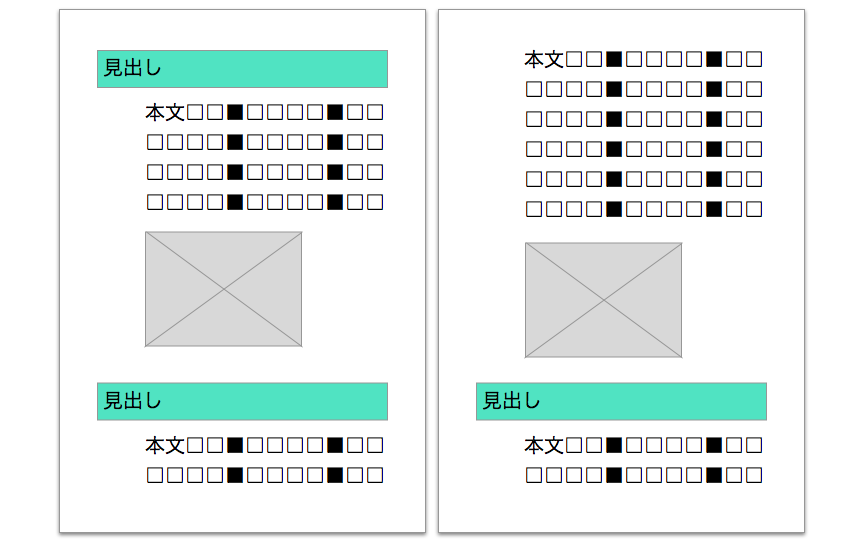
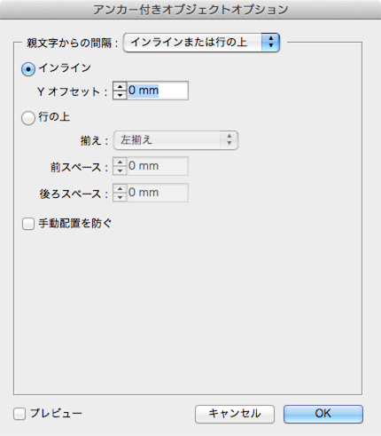
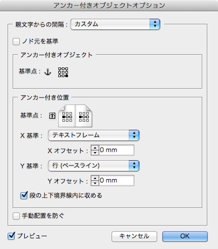

（書名）InDesignインライン流し込み道

chapter1 流し込みやすいフォーマットを作る

# インラインとグリッドを理解する

## 一段組みなら楽勝！というフォーマット作りを目指す

中級者向けのIT書でもっとも多いデザインは、「一段組みで文章の途中に図版やソースコードを挟みつつ、章末またはセクション末までリニアに続いていくタイプ」です。このタイプがより速く組めるようになれば、その分を校正期間に回してクォリティアップを図れるようになります。

このタイプのデザイン指定は、たいていの場合、「各パーツのサイズ」と「パーツ間隔」の指定になりますが、それをそのままフォーマットにしてはいけません。

そのまま各パーツがバラバラの状態で組んでしまうと、後でテキストの追加や削除が発生したときに、それ以降を手作業でずらすことになってしまいます。

では、組み直しが発生しない完璧な原稿をもらえばいい……というのは組む側の都合であって、作っているものが「解説書」である以上、デザインが複雑だから、DTPが大変だから、内容に間違いがあっても直さないというのは本末転倒です。組みやすいフォーマットを作ることで、テキストや画像追加ぐらいなら楽勝！という状態に持って行きましょう。

####コラム：図解タイプは例外
この文書が対象としているのは、最初に説明したように「一段組みで……リニアに続いていくタイプ」です。見開き（2ページ）単位で完結する図解タイプ（できるシリーズなどの初心者向けの解説書）の本や、凝ったレイアウトの雑誌風の書籍には適用できません。そういうタイプの本は、字数に合わせて書けるベテランライターに執筆してもらうか、編集段階で大幅に変更する許可をもらう必要があるでしょう。

（コラムここまで）

## InDesignのインライン機能を見直す
もともとInDesignは、テキストフレームをリンクさせて複数ページに流し込む機能を持っています。しかし、小説のような文字ばかりの本でしか使えないと思っている人が多いのではないでしょうか？　実は「インライン機能」を使いこなせば、かなり凝ったデザインの本でも、リンクしたテキストフレームを使って組むことができます。

インライン機能はテキスト中に他のオブジェクト（フレーム）を挿入する機能ですが、InDesignでは「インラインオブジェクト」と「アンカー付きオブジェクト」の2種類に分かれます。

### インラインオブジェクト

テキスト中に挿入したフレームを右クリックし、［アンカー付きオブジェクト］→［オプション］を選択すると［アンカー付きオブジェクトオプション］ダイアログボックスが表示されます。

ここで［インラインまたは行の上］の［インライン］を選んだ状態がインラインオブジェクトです。

結果を見るとわかるように、文字とまったく同じ扱いになり、オブジェクトのサイズに応じて周りの文字は追い出されます。ただし、回り込みの設定と違って、複数行のテキストがオブジェクトの横に回り込むことはありません。テキスト中の1文字を大きくした場合と同じ状態になります。

なお、「行の上」という設定もありますが、使ったことがないので割愛します。

インラインにしたときにオブジェクトが他の行に重なってしまう場合は、おそらくインラインにした段落のスタイルで行送りが設定されているはずです。行送りを「自動」にしておけば、オブジェクトのサイズに合わせて行が広がります。

### アンカー付きオブジェクト

［アンカー付きオブジェクトオプション］ダイアログボックスで［カスタム］を選んだ状態が、アンカー付きオブジェクトです。インラインよりも設定項目が増え、配置の自由度が上がっています。

結果を見ると、本文と図版にイカリのマークが付き、本文フレームの外に図版が飛び出しています（配置される場所はオプション設定によって変わります）。テキストには影響ありません。

2つの設定のうち、メインで使用するのはインラインのほうです。アンカー付きオブジェクトは細かい設定ができますが、その分コントロールが難しくなります。オブジェクトと本文が重ならないようにしたい場合は、回り込み設定を組み合わせなければいけません。また、ページをまたぐ位置に来たときにオブジェクトが見えなくなったり、うっかりアンカー文字を削除してオブジェクトを消してしまったりするトラブルも起きやすくなります。

アンカー付きオブジェクトを使うのは、オブジェクトの横に本文を回り込ませたいときか、セクションタイトルもインライン扱いにしたいときぐらいです。基本的には単純なインラインを使うことにしたほうが、トラブルが少なくなります。

####コラム：挿入しただけでアンカー付きオブジェクトになってしまう？
テキストに図版を挿入しただけで、何も設定していないのにアンカー付きオブジェクトになってしまうという現象に悩まされたことはないでしょうか？　その場合は、オブジェクトスタイルなどのデフォルト設定に問題があります。選択ツールを選んで何も選択していない状態にしてから、オブジェクトスタイルや段落スタイルのパネルを確認してみてください。何かのスタイルが選ばれてはいないでしょうか？　InDesignでは、未選択状態のスタイルが新たに挿入・新規作成したオブジェクトやテキストに割り当てられるようになっています。未選択状態で各スタイルパネルで「なし」（段落スタイルの場合は「基本段落」）を選んでおけば、初期設定で挿入・新規作成できるようになります。

テキストボックスを作成した時点で予期しない文字スタイルが設定されてしまう場合も原因と対処方法は同じです。未選択状態で各スタイルパネルを確認してください。

（コラムここまで）
